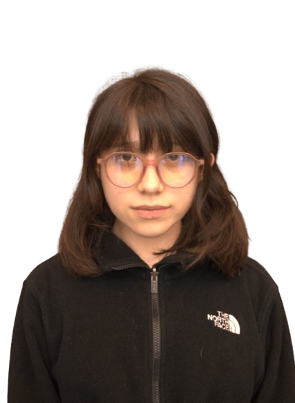
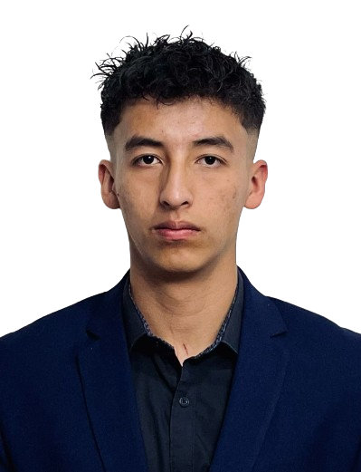
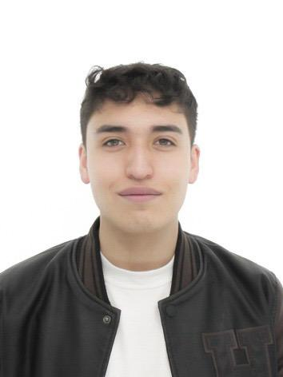
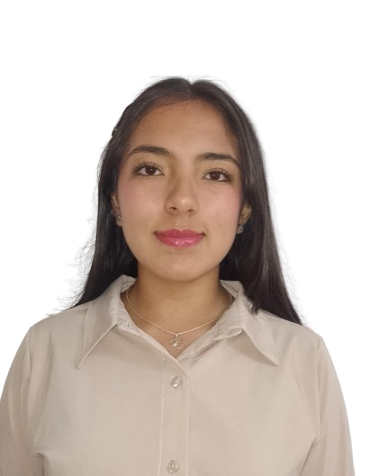
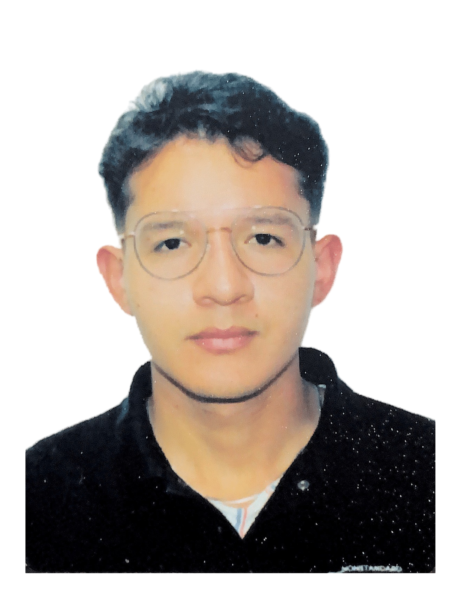

# Water-Propelled Rocket Project – Pro Category (Atenea Proyect) - (2025-10)

This repository contains all the essential files for the water-propelled rocket project, designed to compete in the **Pro** category. The project focuses on building an efficient rocket that maximizes launch distance while strictly adhering to the competition rules and guidelines.

**Note:** Detailed regulations can be found in the attached PDF: `Lanzamiento de Cohetes V2025.pdf`.

---

## Project Overview

The objectives of the project are:
- **Design and Build:** Create a rocket that uses water and air as its propulsion system.
- **Optimize Performance:** Achieve maximum launch distance and high efficiency.
- **Ensure Compliance:** Follow all the rules and safety protocols established for the competition.

---

## Competition Credentials

Our credentials for this competition are as follows:
- **Team Number in Robotic People:** 2021EQ553
- **Atenea Rocket Number:** 2021R1908
- **Atenea 2 Rocket Number:** 2021R1918

---

## Competition Information

Our project competes in the **Pro** category, which establishes the following specifications:

- **Rocket Dimensions:**  
  - Diameter: **12.5 cm**  
  - Maximum Height: **75 cm**

- **Weight Limits:**  
  - Maximum weight (without water): **200 g**  
  - Maximum microcontroller weight: **50 g**

- **Design and Material Standards:**  
  - The rocket must be constructed using plastic materials.  
  - The use of metals, glass, rigid or compact plastics, or any material that can detach and cause an accident is strictly prohibited.  
  - Rockets with pointed tips are not allowed due to safety concerns.

- **Launch System Requirements:**  
  - The rocket must be propelled solely by water and air, with no external power cables allowed.  
  - Each team must supply their own launch base, which should be capable of controlling the launch angle and operated remotely to prevent accidents.  
  - The rocket is required to include an Arduino and a sensor to monitor its trajectory in real-time.

- **Performance Criteria:**  
  - Launch performance will be evaluated over two rounds: one measuring airtime (vertical launch) and the other measuring horizontal distance from the launch platform.  
  - Detailed launch procedures, safety protocols, and penalties for violations are specified in the competition guidelines.

For complete rules and guidelines, please refer to the attached PDF: `Lanzamiento de Cohetes V2025.pdf`.

---
## Repository Structure

```
Atenea_Proyect
├── Documentation
├── Graphic_Resources
├── Designs
└── Code
```

## Documentation Graphic Resources Designs Code

- **Documentation:** Contains all project documentation, reports, meeting minutes, and compliance materials.
- **Graphic Resources:** Houses all visual assets such as images, diagrams, and other graphical elements related to the project.
- **Designs:** Includes design files, technical schematics, drawings, and CAD models.
- **Code:** Contains the source code for embedded systems, control algorithms, data logging, simulations, and other software components.

---

## Contact
For further information or if you have any questions about the project, please reach out via:

Email of the HotBed: Aess@javeriana.edu.co

Project Lead: Santiago Castro Zuluaga
Email of the Chair: Castrozsantiago@javeriana.edu.co

---

## Team Members

### Acknowledgements
We would like to thank all the team members and collaborators who have contributed their time and expertise to make this project possible. Your dedication and effort are essential to our success in the Pro category.

<table align="center">
  <tr>
    <td width="50%" align="center">
      <br>
      Santiago Castro Zuluaga
    </td>
    <td width="50%" align="center">
      <br>
      Carolina Real Vega
    </td>
  </tr>
  <tr>
    <td width="50%" align="center">
      <br>
      Matias Felipe Gonzalez Valencia
    </td>
    <td width="50%" align="center">
      <br>
      Daniel Felipe Robayo Rodríguez
    </td>
  </tr>
  <tr>
    <td width="50%" align="center">
      <br>
      Juan David Roa Camargo
    </td>
    <td width="50%" align="center">
      <br>  
      Daniela Rodriguez Martinez Quiroga
    </td>
  </tr>
  <tr>
    <td width="50%" align="center">
      <br>
      Miguel Angel Gonzalez Rodriguez
    </td>
    <td width="50%" align="center">
      <br>
      Juan David Moran Salazar
    </td>
  </tr>
  <tr>
    <td colspan="2" align="center">
      <br>
      Camilo Andrés Bayona Roa
    </td>
  </tr>
</table>

---

## Licence

This project is distributed under the IEEE AESS Javeriana Bogota License for free and open-source software except the investigation paper and the oficial documentation for the investigation.
